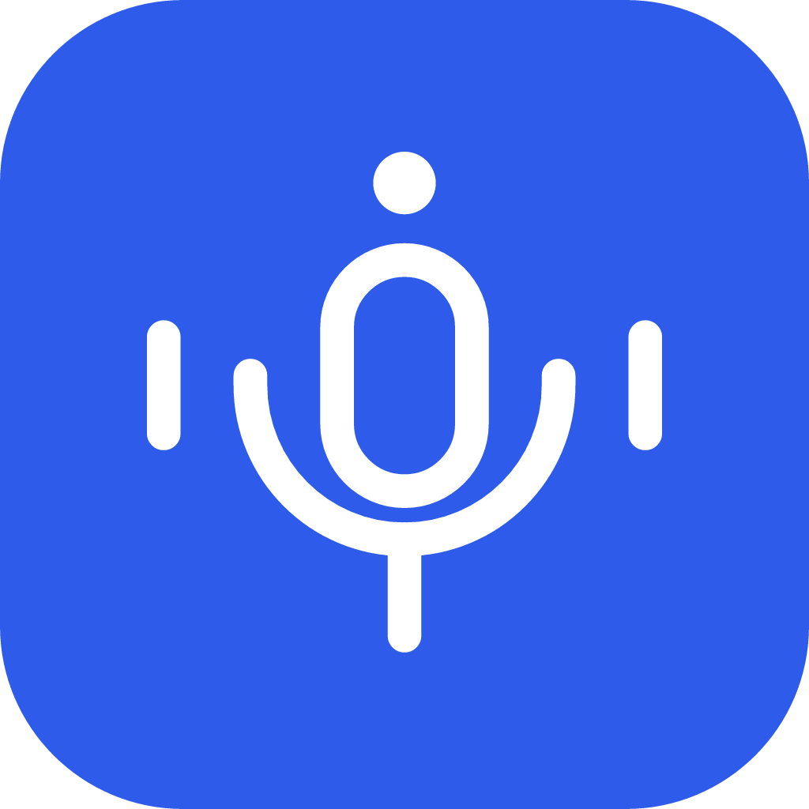

<p align="center">
  
</p>
<h1 align="center">Inaudio</h1>
<p align="center">Your voice, on your machine.</p>
<p align="center">
  Offline dictation and read-aloud for the desktop.<br />
  Built with Electron, React, TypeScript, and sherpa-onnx.
</p>
<p align="center">
  <a href="https://github.com/shikki841/inaudio/actions/workflows/ci.yml"></a>
  <a href="LICENSE"></a>
  <a href="https://github.com/shikki841/inaudio/releases"></a>
</p>
<p align="center">
  <a href="https://github.com/shikki841/inaudio/releases">Downloads</a> ·
  <a href="CONTRIBUTING.md">Contribute</a> ·
  <a href="https://github.com/shikki841/inaudio/issues/new/choose">Report an issue</a>
</p>

## Speak. Edit. Keep going.

- Dictate with a keyboard shortcut and keep a searchable transcript history.
- Read text or your clipboard aloud with on-device speech synthesis.
- Manage speech models, microphone settings, and playback in one desktop app.

Download a model once, then run inference locally. Model downloads need an internet connection. Desktop packages target Windows, macOS, and Linux; permissions and text insertion vary by platform. Production releases are signed and distributed through electron-builder update manifests; development and pull-request builds do not contact the update feed.

Speech-to-text includes NVIDIA Nemotron ASR Streaming, an English cache-aware streaming model with a 560 ms latency/accuracy profile. It runs through sherpa-onnx on the CPU after its verified model archive is downloaded; the model remains subject to the [NVIDIA Open Model License](https://www.nvidia.com/en-us/agreements/enterprise-software/nvidia-open-model-license/).

## Run locally

Use Node.js 24 LTS and npm. Native packaging prerequisites are in [CONTRIBUTING.md](CONTRIBUTING.md).

```sh
git clone https://github.com/shikki841/inaudio.git
cd inaudio
npm ci
npm start
```

```sh
npm run check   # TypeScript + ESLint
npm run package:release  # Build the electron-builder package for your current OS
```

Pick a model during setup and grant microphone access when prompted.

## Build with us

Small fixes, platform testing, and clear bug reports help. Read the [contribution guide](CONTRIBUTING.md), [community guidelines](CODE_OF_CONDUCT.md), and [release process](.github/RELEASING.md). Report vulnerabilities through the [security policy](SECURITY.md).

[MIT](LICENSE). Downloaded models and dependencies retain their own licenses.
